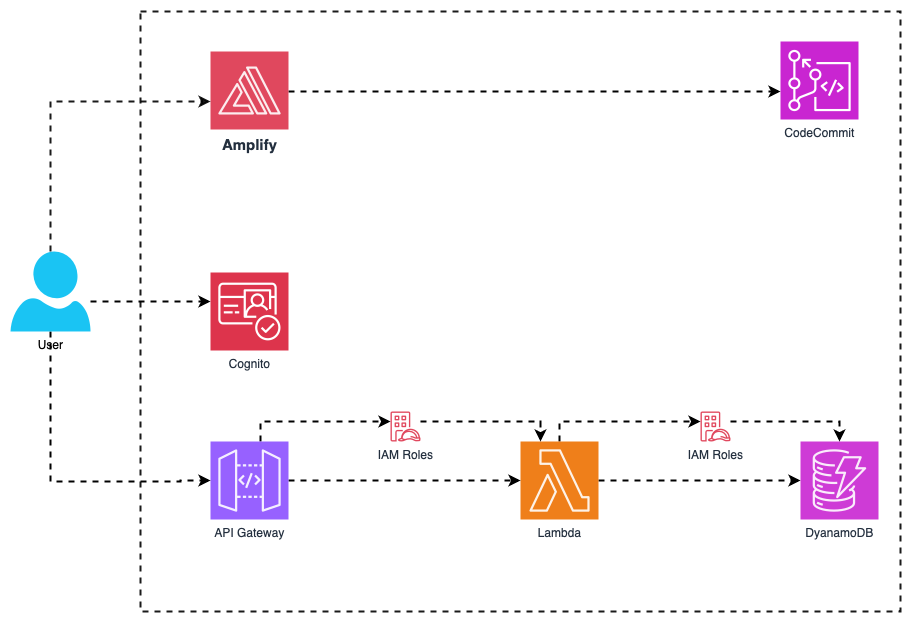

# wildrydes-site

AWS Project - Serverless Web Application

### Description
In this end-to-end web application we are using **CodeCommit**, **Amplify**, **Cognito**, **Lambda**, **IAM**, **API Gateway**, and **DynamoDB**.

The workflow typically operates as follows: **CodeCommit** acts as the Git-based source control to manage code. 

**Amplify** is used for hosting and deploying the front-end, while integrating with **Cognito** for user authentication and authorization. 

**Lambda** provides serverless backend logic, triggered by requests via **API Gateway**, which routes these requests securely. 

**IAM** controls access and permissions for users and services, ensuring secure interactions. 

Finally, **DynamoDB** serves as the NoSQL database for storing and retrieving data. This serverless approach creates a secure, scalable, and automated web application pipeline.

## Serverless Architecture

This repository contains AWS workshop, 'Build a Serverless Web Application'. For further information about this workshop, please visit [here](https://awstip.com/cloud-a-simple-way-to-build-a-serverless-web-application-on-aws-1-1efdeb6374c4).

[AWS-BUILD-A-SERVERLESS-WEBAPP](https://aws.amazon.com/getting-started/hands-on/build-serverless-web-app-lambda-apigateway-s3-dynamodb-cognito/)

#### Reference
[Click Here](https://www.youtube.com/watch?v=zuKu0VFiwas&list=PLwyXYwu8kL0wMalR9iXJIPfiMYWNFWQzx&index=2)

